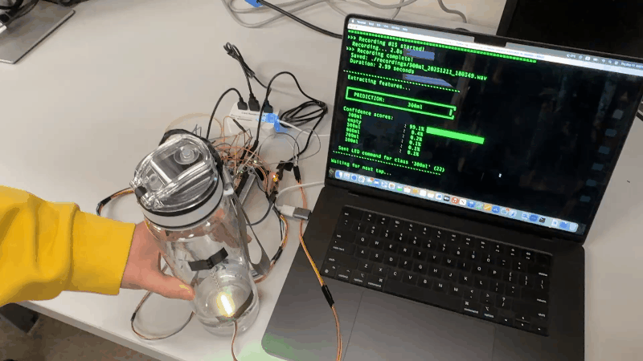

# HydroSense — Tap-Triggered Water-Level Classifier

**HydroSense** turns a regular (non-transparent) water bottle into a “smart” bottle by estimating the **water level** using **vibration/audio sensing** + a lightweight **ML classifier**, then displaying the predicted class on a **WS2812B (NeoPixel) LED strip**.

> EECS 373: Introduction to Embedded System Design (Winter 2025) — University of Michigan

---

## Poster
<p align="center">
  
</p>

---

## Demos (GIFs)

### 300 mL shake
<p align="center">
  
</p>

### 700 mL shake
<p align="center">
  
</p>

---

## Motivation

Touching a bottle to check water level is easy when it’s transparent—hard when it isn’t. HydroSense explores a **low-cost, flexible** approach that works on ordinary bottles by using **vibration/audio sensing** and a lightweight **SVM** classifier.

---

## Project Description

HydroSense uses:
1. **IMU** detects a tap/motion event to trigger recording  
2. **VPU microphone** captures bottle vibration audio (PDM)  
3. **STM32 (NUCLEO-L4R5ZI-P)** captures audio using **DFSDM + DMA**  
4. Audio is streamed over **UART** to a laptop  
5. Laptop extracts **MFCC features** and runs a **Linear SVM** classifier  
6. Laptop sends back a **1-byte LED command**  
7. STM32 updates **WS2812B LED** color/pattern based on predicted class
   
### Water-Level Classes

We classify into **6 classes**:
```python
classes = ['empty', '100ml', '300ml', '500ml', '700ml', '900ml']


# Tap-Triggered Shake Classifier

Embedded + Python pipeline for classifying “shake” gestures captured by an STM32L4R5 board. The board listens for IMU tap interrupts, records microphone audio with DFSDM+DMA, and sends PCM over UART; the laptop scripts save WAVs, train a linear SVM, and run live inference.

## Repo Layout
- `Core/`, `Drivers/`, `startup_stm32l4r5xx.s`: STM32CubeMX-generated firmware (C).
- `real_final_project.ioc`: CubeMX project file.
- `tap_recorder.py`: Laptop-side UART capture that waits for START/STOP markers and writes each recording to WAV.
- `tap_classifier.py`: Capture + feature extraction + SVM inference (uses saved `models/` artifacts).
- `uart_pcm_to_wav.py`: Lower-level UART PCM recorder with sync framing only.
- `processing.ipynb`: Notebook to extract MFCCs, train, and export the model.
- `data/`: Example labeled WAVs for training (`half_shake`, `quarter_shake`, `three_quarter_shake`).
- `models/`: Serialized artifacts (`svm_model.pkl`, `scaler.pkl`, `label_encoder.pkl`).

## Firmware (STM32)
- MCU: STM32L4R5ZI, DFSDM microphone path with double-buffered DMA.
- IMU: LSM6DSO32 configured for single-tap; EXTI interrupt sets `g_single_tap_flag`.
- UART: `LPUART1` used for all `printf` output. PCM streaming hooks are present but commented out (see `HAL_DFSDM_FilterRegConvHalfCpltCallback` / `CpltCallback` in `Core/Src/main.c`).
- To build/flash: use STM32CubeIDE with `real_final_project.ioc` or CMake (`CMakeLists.txt` + `cmake/stm32cubemx`). Flash to the board, power the mic/IMU, and open the UART at 115200 baud to see logs.

### UART audio framing (expected by Python tools)
When enabled, each PCM frame should be sent as:
```
0xAA 0x55  <len_lo> <len_hi>  <PCM bytes little-endian, len samples * 2 bytes>
```
`tap_recorder.py` also looks for `START_MARKER = 0xBB 0x66` and `STOP_MARKER = 0xCC 0x77` around recordings. Implement `uart_send_pcm_block` or similar in the DFSDM callbacks to emit this framing for the scripts to work.

## Python Environment
```
python3 -m venv .venv
source .venv/bin/activate
pip install pyserial librosa numpy scikit-learn joblib
```
(On macOS you may need `brew install libsndfile` for librosa.)

## Collect Data
1) Flash firmware and connect the board’s UART.
2) Run the recorder, pointing at your serial port:
```
python tap_recorder.py -p /dev/cu.usbserial-XXXX -b 921600 -o recordings
```
3) Perform shakes after each tap trigger; WAVs accumulate in `recordings/`.

## Train the Model
1) Open `processing.ipynb`.
2) Update `data_dir` if needed; classes expected: `half_shake`, `quarter_shake`, `three_quarter_shake`.
3) Run all cells to extract MFCC stats, scale features, train a linear SVM, and save artifacts to `models/`.

## Run Live Classification
```
python tap_classifier.py -p /dev/cu.usbserial-XXXX -b 921600 -o recordings_live -m models
```
The script waits for a tap-triggered recording, saves a WAV, extracts MFCCs, scales them with the stored scaler, loads `svm_model.pkl`, and prints the predicted class with probabilities.

## Notes and Troubleshooting
- If no audio reaches the PC, ensure the firmware is actually sending PCM frames with the `0xAA 0x55` + length protocol; the current code only emits text logs.
- Adjust `SAMPLE_RATE`/`baudrate` in the Python scripts to match firmware settings.
- Use `uart_pcm_to_wav.py` to debug raw PCM framing without the tap protocol (it just listens for sync headers and length fields).

